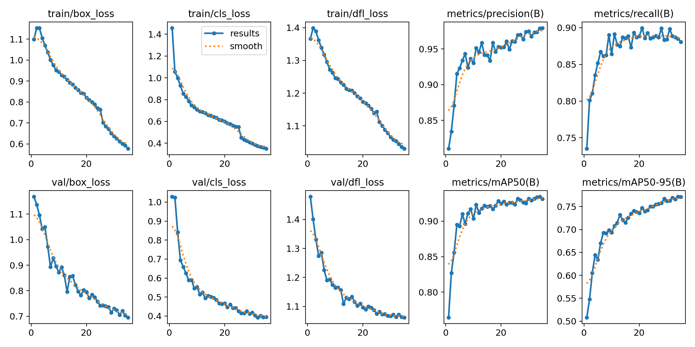

## License Plate Detector

Легкий проект для детекции автомобильных номерных знаков на видео и в реальном времени. Основан на YOLO и рассчитан на быстрый запуск локально или в Docker.

### Демо


### Результаты



### Метрики обучения

- **mAP50-95**: 0.77156
- **mAP50**: 0.93451
- **Precision**: 0.97896
- **Recall**: 0.88509

### Возможности

- Обработка видеофайлов с сохранением результата.
- Потоковая детекция с веб-камеры.
- Логи в папке [data/](data/).
- Готовые веса в [best.pt](best.pt).

### Быстрый старт

1) Установите зависимости.

Если используете Poetry:

```bash
poetry install
```

2) Запуск видеообработки.

```bash
poetry run python main.py --mode video --input data/input.mp4 --output data/output.mp4
```

3) Запуск потоковой детекции.

```bash
poetry run python main.py --mode stream
```

### Docker

Сборка и запуск через docker-compose:

```bash
docker compose up --build video_processor
```

Для потокового режима:

```bash
docker compose up --build live_stream
```

### Как это устроено

- Входная точка CLI находится в [main.py](main.py).
- Модель и инференс описаны в [model_impl.py](model_impl.py).
- Docker-сборка — в [Dockerfile](Dockerfile) и [docker-compose.yml](docker-compose.yml).

### Примечания

- Веса можно заменить, указав `--weights` и путь до модели.
- Видеофайлы и результаты удобно хранить в [data/](data/).
